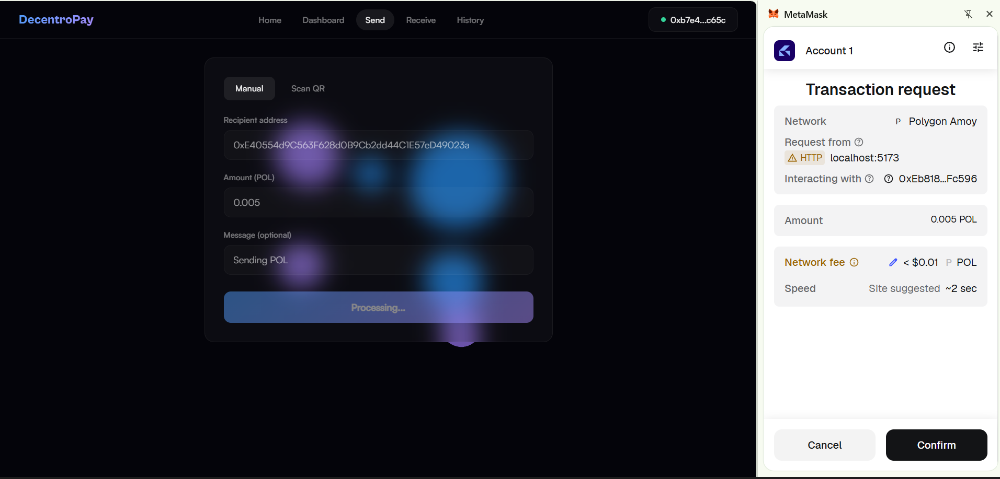
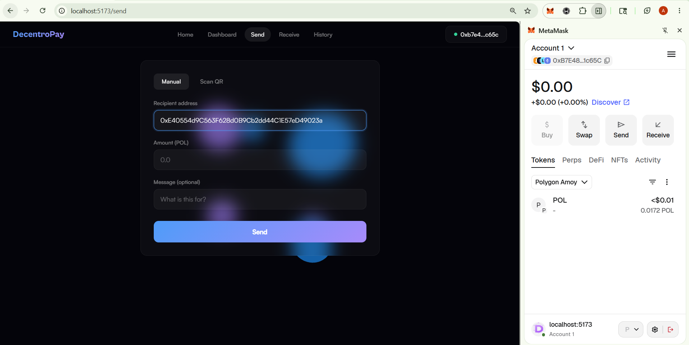
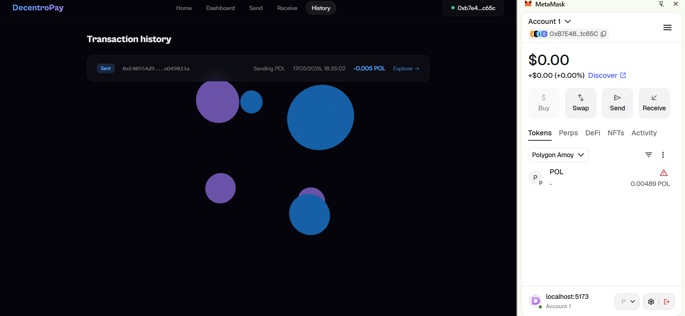
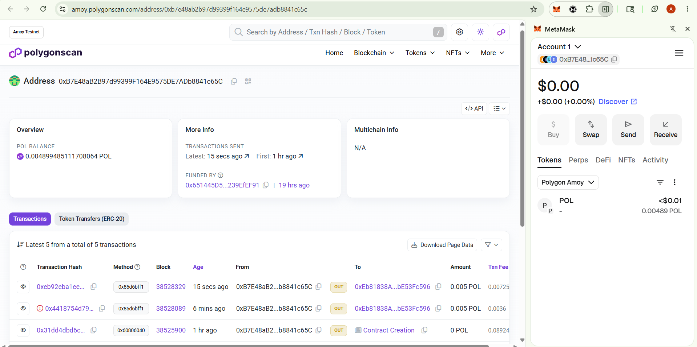

# DecentroPay 🚀

DecentroPay is a decentralized crypto payment application built on blockchain technology.

Inspired by modern payment apps like PhonePe and Google Pay, DecentroPay enables users to send and receive crypto payments directly through smart contracts without relying on banks or intermediaries.

Built with Solidity, React, Ethers.js, and deployed on the Polygon Amoy Testnet.

---

## 🚀 Live Demo & Deployed Contracts

<div align="center">
  <br />
  <table>
    <tr>
      <td align="center" width="350" style="padding: 15px;">
        <p><b>🌐 Frontend Client</b></p>
        <p>Access the decentralized QR payment gateway dashboard.</p>
        <a href="https://decentropay.vercel.app" target="_blank">
          
        </a>
      </td>
      <td align="center" width="350" style="padding: 15px;">
        <p><b>📜 Smart Contract</b></p>
        <p>Verify contract events and history on the block explorer.</p>
        <a href="https://amoy.polygonscan.com/address/0xEb81838AF6Bd5677e1Ba211A0761948bE53Fc596" target="_blank">
          
        </a>
      </td>
    </tr>
  </table>
  <br />
</div>

---

## ✨ Features

* 🔐 Connect MetaMask wallet
* 💸 Send crypto payments securely
* 📱 QR code-based payment flow
* 🧾 On-chain transaction history
* ⚡ Real-time transaction updates using smart contract events
* 🌐 Polygon Amoy testnet integration
* 🔍 Transaction verification on PolygonScan
* 🛡️ Secure smart contract using OpenZeppelin ReentrancyGuard

---

## 🛠️ Tech Stack

### Blockchain

* Solidity
* Hardhat
* OpenZeppelin

### Frontend

* React.js
* Vite
* Ethers.js

### Network

* Polygon Amoy Testnet

---

## 📸 Project Screenshots

### MetaMask Transaction Confirmation



---

### Successful Transaction



---

### On-Chain Transaction History



---

### PolygonScan Transaction Verification



---

## ⚙️ Local Setup

Clone the repository:

```bash
git clone <your-repository-url>
cd DecentroPay
```

Install backend dependencies:

```bash
npm install
```

Compile smart contracts:

```bash
npx hardhat compile
```

Deploy to Polygon Amoy:

```bash
npx hardhat run scripts/deploy.js --network polygonAmoy
```

Start frontend:

```bash
cd frontend
npm install
npm run dev
```

---

## 🔑 Environment Variables

### Root `.env`

```env
PRIVATE_KEY=your_wallet_private_key
POLYGON_AMOY_RPC=https://rpc-amoy.polygon.technology
```

### Frontend `.env`

```env
VITE_CONTRACT_ADDRESS=your_deployed_contract_address
VITE_EXPLORER_URL=https://amoy.polygonscan.com/address/
```

---

## 📌 Future Improvements

* Multi-token payment support
* Wallet transaction analytics
* Mobile responsiveness enhancements
* ENS / wallet nickname support
* Mainnet deployment
* Push notifications for payments

---

## 📄 License

This project is licensed under the MIT License.
